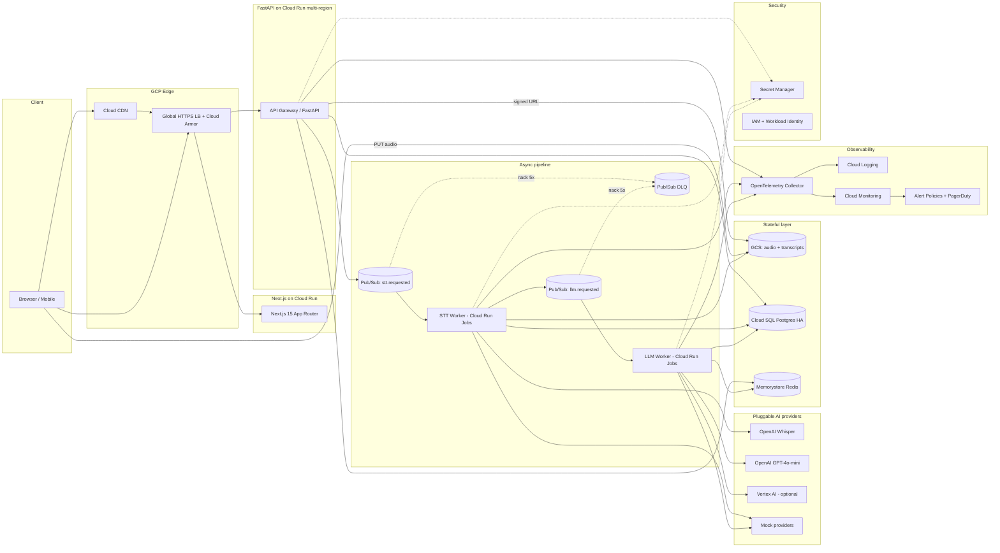
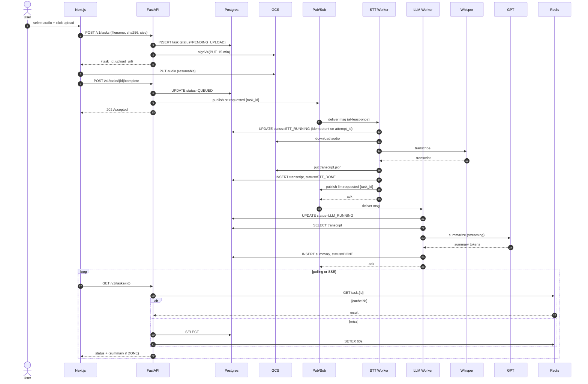
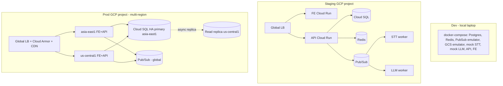

# AI Processing Platform — Architecture

> A scalable, observable, multi-region AI task platform on GCP. Audio → STT → LLM summary → queryable result.

**Target SLOs:** API p99 < 300 ms (excluding model latency) · Task end-to-end p95 < 90 s for ≤ 10 min audio · Availability 99.9 % monthly.

---

## 1. System Architecture



### Logical boundaries

| Service | Responsibility | Stateless? |
|---|---|---|
| **Next.js frontend** | Upload UI, task status polling, results view, auth (Firebase Auth / NextAuth) | yes |
| **API Gateway (FastAPI)** | Auth, signed GCS upload URLs, task CRUD, publishes to Pub/Sub, read API | yes |
| **STT Worker** | Subscribes `stt.requested`, calls provider, writes transcript, publishes `llm.requested` | yes |
| **LLM Worker** | Subscribes `llm.requested`, calls provider, writes summary, updates task | yes |
| **Provider adapter** | Abstract interface, concrete impls per provider, **plug-in registry** for new tasks | yes |
| **Postgres** | Source of truth: tasks, transcripts, summaries, audit log | stateful |
| **Redis** | Hot-path cache (result lookup, idempotency keys, rate limit counters) | stateful |
| **GCS** | Audio blobs + raw transcript JSON | stateful |
| **Pub/Sub** | Decoupled queues, per-stage topics, DLQ on 5 redeliveries | managed |

---

## 2. Sequence Diagram



---

## 3. Technology Selection & Rationale

| Layer | Choice | Why | Trade-off |
|---|---|---|---|
| Frontend | **Next.js 15 (App Router, TS)** | SSR for SEO, RSC for fast initial load, file-based routing, easy Cloud Run deploy | Heavier than Vite SPA — acceptable for a real product surface |
| Backend | **FastAPI + Python 3.12** | Async I/O matches network-bound AI calls; Pydantic v2 = strong contracts; OpenAPI free; ML ecosystem | Python GIL — mitigated by async + multiple Cloud Run instances |
| Workers | **Cloud Run (request-driven Pub/Sub push)** | Scale to zero, per-request billing, no cluster ops | Cold start ~1 s — pre-warm via min-instances=1 in prod |
| Queue | **Pub/Sub** | Managed, infinite scale, native DLQ, push to Cloud Run | Vendor lock-in — abstracted behind a `MessageBus` interface |
| Primary DB | **Cloud SQL Postgres 16 HA** | ACID, JSONB for flexible result shapes, regional HA failover, mature tooling | Costlier than Firestore — needed for joins + transactional state machine |
| Cache | **Memorystore Redis** | Sub-ms latency, idempotency keys, rate limits, hot result cache | Extra moving part — kept small (1 GB) |
| Blob | **GCS** | Cheap, signed URLs offload upload bandwidth from API, lifecycle to coldline | Eventual consistency on bucket listings — irrelevant here |
| Secrets | **Secret Manager + Workload Identity** | No key files in containers, audit log, rotation | Slight lookup overhead — cached on cold start |
| Edge | **Global HTTPS LB + Cloud Armor + Cloud CDN** | Multi-region, WAF, anycast, DDoS protection | Costs ~$18/mo idle — required for SLO |
| AI | **OpenAI (default) + Vertex AI (alt) + Mock (test)** behind `STTProvider` / `LLMProvider` ports | Pluggable, vendor-neutral, mockable in tests | Each provider needs its own retry/error mapping |
| IaC | **Terraform** | Multi-cloud-portable, mature GCP provider, plan/apply review | Slower than Pulumi for Python folks — chosen for ecosystem |
| CI/CD | **GitHub Actions + OIDC to GCP** | Free for public repos, no long-lived keys, matrix builds | Limited to 6h job — fine for this pipeline |
| Observability | **OpenTelemetry → Cloud Logging/Trace/Monitoring** | Vendor-neutral SDK, trace context propagated through Pub/Sub | One more sidecar in workers — worth it |

---

## 4. Architecture Characteristics

### 4.1 Scalability

- **Horizontal everywhere:** API + workers on Cloud Run, autoscale 0 → 100 instances per region; concurrency=80 per instance.
- **Backpressure:** Pub/Sub absorbs spikes; workers pull at safe rate. Per-tenant token-bucket in Redis caps abuse.
- **Pre-signed uploads:** audio bytes never traverse the API — bandwidth scales with GCS.
- **Multi-region active-active:** `asia-east1` + `us-central1`. Global LB routes to nearest healthy region. DB stays single-region with cross-region read replica (write to primary).
- **Plug-in tasks:** new AI stages register a `TaskHandler` against a Pub/Sub topic — adding "translation" or "moderation" is one file + one topic.

### 4.2 Fault tolerance

- **At-least-once + idempotency:** every worker writes `(task_id, attempt_id)` upserts; retries safe.
- **Stage state machine:** explicit `PENDING_UPLOAD → QUEUED → STT_RUNNING → STT_DONE → LLM_RUNNING → DONE | FAILED`; resumable on crash.
- **DLQ:** after 5 redelivery attempts, message moves to DLQ topic → alert fires → human inspection.
- **Provider failover:** circuit breaker (PyBreaker); on open, route to alternate provider (e.g., Whisper → Vertex Chirp).
- **DB HA:** Cloud SQL regional HA with auto failover; PITR enabled (7-day window).
- **Graceful degradation:** if LLM is down, STT result still saved + queryable; LLM retried via DLQ replay tool.

### 4.3 Data consistency

- **Outbox pattern:** API writes task row + outbox event in one Postgres tx; a sweeper publishes to Pub/Sub. Guarantees "no orphan events" even if Pub/Sub publish fails.
- **Idempotency keys:** client-supplied + server-derived `(task_id, stage, attempt_id)` `UNIQUE` constraints.
- **Read-after-write:** results cached in Redis only after DB commit.
- **Schema migrations:** Alembic, forward-only, expand-then-contract.

### 4.4 Latency & performance

- **Streaming summaries:** LLM worker streams tokens to Redis pubsub; FastAPI SSE endpoint forwards to UI → user sees output in 1–2 s.
- **Whisper chunking:** audio > 10 min split into 5-min chunks processed in parallel, then merged.
- **Result cache:** completed tasks served from Redis (60 s) then Cloud CDN (1 h via signed Cache-Control).
- **Connection pooling:** PgBouncer sidecar in API (transaction mode).
- **Min instances:** API min=2 per region in prod to kill cold starts.

### 4.5 Security

- **Auth:** Firebase Auth (Google / passwordless). JWT verified at FastAPI middleware.
- **Per-tenant isolation:** every row carries `tenant_id`; row-level filters enforced in repository layer.
- **Signed upload URLs:** 15-min TTL, content-length + content-type bound.
- **Cloud Armor:** OWASP rules, geo-fence option, rate limit.
- **Encryption:** TLS 1.3 in transit; CMEK at rest for GCS + Cloud SQL.
- **Secrets:** Secret Manager + Workload Identity; no JSON key files. `.env.example` only in repo.
- **CSP + CORS:** strict allow-list on the frontend.
- **Audit log:** every write goes through a `audit_log` table; Cloud Audit Logs enabled on GCP services.

### 4.6 Observability

- **Tracing:** OTel SDK in all services; trace ID propagated via Pub/Sub message attributes — one trace covers upload → STT → LLM.
- **Logs:** structured JSON, `task_id` + `trace_id` on every line, shipped to Cloud Logging.
- **Metrics:** Cloud Monitoring custom metrics — `task_duration_seconds{stage}`, `provider_latency_seconds{provider}`, `queue_depth`, `dlq_size`.
- **SLO dashboards:** task success rate, p95 end-to-end, API availability.
- **Alerts:** DLQ > 0, error rate > 1 %, p95 > 90 s, Cloud SQL CPU > 80 % → PagerDuty + Slack.
- **Tracing the model:** prompt + completion logged to a sampled `llm_audit` table (1 % sample, 30-day retention) for quality review.

---

## 5. Deployment & Operations

### 5.1 Topology



Environment promotion: **Dev (laptop) → Staging (small GCP project, real services) → Prod (multi-region GCP project)**. Identical Terraform modules, per-env tfvars.

### 5.2 CI/CD

```mermaid
flowchart LR
  Dev[Developer push / PR] --> A1[GitHub Actions]
  A1 --> L[Lint: ruff, mypy, eslint, tsc]
  L --> T[Test: pytest, vitest]
  T --> SCA[Security: pip-audit, npm audit, trivy, gitleaks]
  SCA --> B[Build container images]
  B --> P[Push to Artifact Registry - signed with cosign]
  P --> TF[terraform plan - PR comment]
  TF -- merge to main --> DS[Deploy Staging via OIDC]
  DS --> E2E[Playwright e2e against staging]
  E2E --> Tag[Git tag vX.Y.Z]
  Tag --> Gate{Manual approval}
  Gate -- approve --> CAN[Canary 10% prod traffic]
  CAN --> Watch[Auto-watch error rate + p95 - 10 min]
  Watch -- healthy --> Full[Promote to 100%]
  Watch -- regression --> RB[Auto rollback via traffic split]
```



### 5.3 Versioning, release & rollback

- **SemVer tags** drive prod deploys; image tag = `${git_sha}-${semver}`.
- **Cloud Run revisions:** every deploy is an immutable revision. Rollback = `gcloud run services update-traffic --to-revisions <prev>=100`. Sub-30-second rollback.
- **DB migrations:** expand-then-contract; deploys never gate on contract step. Alembic runs in a one-shot Cloud Run Job before traffic shift.
- **Feature flags:** OpenFeature SDK + GCS-backed config; risky changes ship dark, ramp via flag.
- **Canary:** 10 % traffic for 10 min; auto-rollback if error rate > 1 % or p95 > 1.5× baseline.

---

## 6. Architecture Decision Record (summary)

| # | Decision | Alternatives | Why this |
|---|---|---|---|
| ADR-001 | FastAPI over Flask/Django | Flask (sync), Django (heavy) | Async fits AI I/O; Pydantic contracts |
| ADR-002 | Pub/Sub over RabbitMQ/Kafka | RMQ (ops), Kafka (overkill) | Managed, scale-to-zero, push to Cloud Run |
| ADR-003 | Cloud Run over GKE | GKE (powerful, ops-heavy) | Zero ops, scale to zero, fits workload profile |
| ADR-004 | Postgres over Firestore | Firestore (serverless) | Transactional state machine, joins, JSONB hybrid |
| ADR-005 | Pluggable providers via ports/adapters | Hard-coded OpenAI | Vendor risk, testability, plug-in tasks bonus |
| ADR-006 | OIDC GitHub→GCP over JSON keys | Service account JSON | No long-lived secrets, audit-friendly |
| ADR-007 | Terraform over Pulumi/gcloud | Pulumi (Python DSL) | Provider maturity, plan-review workflow |
| ADR-008 | OpenTelemetry over vendor SDK | Cloud Trace SDK only | Portability if we leave GCP |
| ADR-009 | Outbox pattern for publish | Direct publish | Avoid lost events on Pub/Sub blip |
| ADR-010 | Streaming LLM via SSE + Redis pubsub | Long-poll only | Perceived latency win for users |

---

## 7. Repository Layout

```
.
├── ARCHITECTURE.md
├── CLAUDE.md                  # Guidance for Claude Code agents
├── README.md
├── docker-compose.yml         # Local dev: full stack with emulators + mocks
├── .github/workflows/         # CI/CD pipelines
├── backend/                   # FastAPI service
│   ├── app/
│   │   ├── api/               # Routers (tasks, health, sse)
│   │   ├── core/              # Config, auth, logging, OTel
│   │   ├── domain/            # Entities, state machine
│   │   ├── providers/         # STTProvider, LLMProvider ports + impls
│   │   ├── infra/             # PG repo, Redis, Pub/Sub, GCS
│   │   ├── workers/           # stt_worker.py, llm_worker.py
│   │   └── main.py
│   ├── alembic/               # Migrations
│   ├── tests/
│   └── pyproject.toml
├── frontend/                  # Next.js 15
│   ├── src/app/
│   ├── src/components/
│   ├── src/lib/
│   ├── tests/                 # vitest + playwright
│   └── package.json
├── infra/                     # Terraform
│   ├── modules/
│   │   ├── network/
│   │   ├── cloud-run/
│   │   ├── cloud-sql/
│   │   ├── pubsub/
│   │   ├── gcs/
│   │   ├── secret-manager/
│   │   ├── observability/
│   │   └── edge/              # LB + Armor + CDN
│   └── envs/
│       ├── staging/
│       └── prod/
└── docs/
    ├── adr/                   # ADR-001 … ADR-010
    ├── runbooks/              # DLQ replay, region failover, secret rotation
    └── demo-script.md
```

---

## 8. What's NOT in scope (future work)

- Multi-cloud failover (only GCP today; abstractions are ready for AWS sibling).
- Self-hosted Whisper / open LLM on GPU pool (cost trigger: >2 M minutes/month).
- Per-tenant model fine-tuning + RAG.
- Real-time transcription (WebSocket streaming STT).
